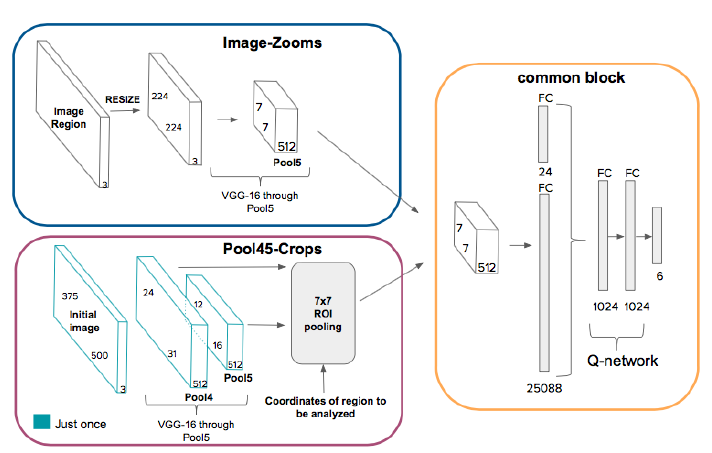
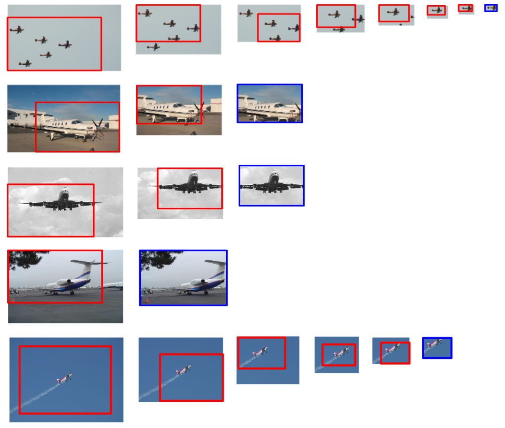
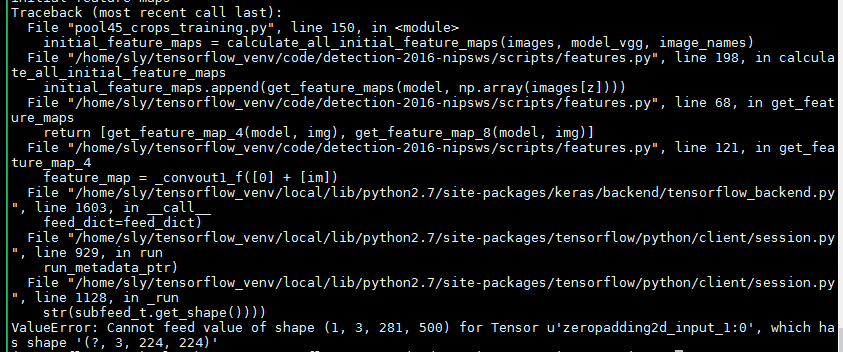
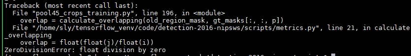

# Hierarchical Object Detection with Deep Reinforcement Learning

## Abstract
> 关键的思想在于关注图像中包含更丰富信息的那些部分并放大它们。


## Introduction
1. 考虑区域之间的联系，
2. 利用top-down的扫描方式，首先获取整个图像，关注局部区域的相关信息，
3. 基于增强学习训练的代理（agent）有能力检测图像中的对象
<!-- more --> 

## Hierarchical Object Detection Model
###### **1. Markov Decision Process（马尔科夫决策过程）**
> State:当前区域描述符（the descriptor of current region）和记忆向量（memory vector）

> Actions:move actions和terminal actions

> Reward:
保证move action都是朝着更靠近ground truth的方向移动；
当IOU超过threshold，则终止移动。

###### **2. Q-learning**
```math
Q(s,a) = r+\lambda{max}_{a'}Q(s',a')
```

###### **3. Model**
* the Image-Zooms model
> 使用VGG-16提取图像区域特征向量`$(7*7*512)$`,
> 拼接区域特征向量与记忆向量（memory vector）`$(7*7*512+24=25088+24)$`,
> 经过两个1024维的全连接层，输出6个可能的动作（actions），
> 反复迭代，直到终止动作

* the Pool45-Crops model



###### **4. Training**


## Experiments

###### **1. Qualitative Results**



## [Implementation](https://github.com/imatge-upc/detection-2016-nipsws)

###### **1. keras实现**
* 提取区域特征


* state不断更新，并作为model的输入
```math
(7*7*512)
```
* 

## 代码问题总结
1. 数据类型错误**TypeError: slice indices must be integers or None or have an __index__ method**

这是由于数组，矩阵等类型数据的下标是整数，而在

```
   region_mask[offset[0]:offset[0] + size_mask[0]
                            , offset[1]:offset[1] + size_mask[1]] = 1
```
offset是float类型，所以报错，解决方法就是数据类型转换：

```
  region_mask[int(offset[0]):int(offset[0] + size_mask[0])
                            , int(offset[1]):int(offset[1] + size_mask[1])] = 1
```

2. VGG16提取图像特征尺寸不对



解决方法：在图片提取特征之前，对图像进行resize；

```
im = images[z].resize((224, 224))
```
3. 除0错误



对图像进行resize的位置错误


## 问题总结
1. 问题：记忆向量的哪儿来的？
2. 问题：哪6个动作？
> move actions:左上、右上、左下、右下和中；
> terminal actions
3. 问题：每个类训练一个模型？
> 是的，这篇文章中只训练了飞机类（aeroplane）的检测模型