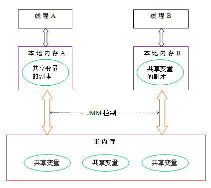

# Java内存模型

## Java内存模型的基础
### 并发编程模型的两个关键问题

1. 线程之间如何通信？
2. 线程之间如何同步？

通信是指线程之间以何种机制交换信息，在命令式编程中线程之间的通信机制有两种：共享内存和消息传递。在共享内存模型中，线程之间共享程序的公共状态，通过读写内存中的公共状态进行隐式通信；而在消息传递的并发模型中，线程之间没有公共状态，线程之间必须通过发送消息来显式进行通信。  
<!-- more --> 
同步是指程序中用来控制不同线程间操作发生的相对顺序的机制。在共享内存并发模型中，同步是显式进行的。程序员必须显式指定某个方法或某个代码段需要在线程之间互斥执行。在消息传递的并发模型中，由于消息的发送必须在消息的接收之前，因此同步是隐式进行的。  
Java的并发采用的是共享内存模型，Java线程之间的通信总是隐式进行的，整个通信过程对于程序员完全透明。

### Java内存模型的抽象结构
在Java中，所有实例域、静态域和数组元素都存储在堆内存中，堆内存在线程之间共享。局部变量（Local Variables），方法定义参数（Formal Method Parameters）和异常处理器参数（Exception Handler Parameters）不会在线程之间共享，它们不会有内存可见性问题，也不受内存模型的影响。  
Java线程之间的通信由Java内存模型（JMM）控制，JMM决定一个线程对共享变量的写入何时对另一个线程可见。从抽象的角度来看，JMM定义了线程和主内存之间的抽象关系：线程之间的共享变量存储在主内存（Main Memory）中，每个线程都有一个私有的本地内存（Local Memory），本地内存中存储了该线程读写共享变量的副本。本地内存是JMM的一个抽象概念，它涵盖了缓存、写缓冲区、寄存器以及其他的硬件和编译器优化。

由上图看出线程A和线程B之间要通信的话，必须经历以下两个步骤：  
1）.线程A把本地内存A中更新过的共享变量 刷新到主内存中去；
2）.线程B到主内存中去读取线程A之前已更新过的共享变量。

### 指令重排序
在执行程序时，为了提高性能，编译器和处理器常常会对指令做重排序。重排序分为3种类型。  
1）编译器优化的重排序。编译器再不改变单线程程序语义的前提下，可以重新安排语句的执行顺序。
2）指令级并行的重排序。现代处理器采用了指令级并行技术（Instruction-Level Parallelism，ILP）来将多条指令重叠执行。如果不存在数据依赖性，处理器可以改变语句对应机器指令的执行顺序。  
3）内存系统的重排序。由于处理器使用缓存和读写缓冲区，这使得加载和存储操作看上去可能是乱序执行。

## happens-before
在JMM中，如果一个操作执行的结果需要对另一个操作可见，那么这两个操作之间必须要存在happens-before关系。这里提到的两个操作，既可以在一个线程之内，也可以在不同线程之间。  
与程序员密切相关的happens-before规则如下：  
- 程序顺序规则：一个线程中的每个操作，happens-before于该线程中的任意后续操作。（也就是说一个线程中的每个操作的结果对于该线程中的其他操作都是可见的）
- 监视器锁规则：对一个锁的解锁，happens-before于随后对这个锁的加锁。（也就是说一个锁的解锁操作需要对该锁的解锁操作可见）
- volatile变量规则：对一个volatile域的写，happens-before于任意后续对这个volatile域的读。
- 传递性：如果`A happens-before B`，且`B happens-before C`，那么`A happens-before C`。