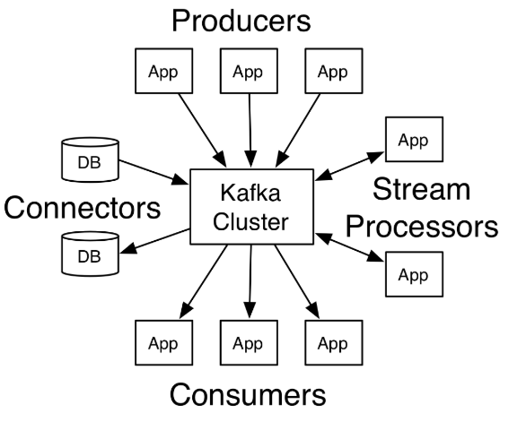
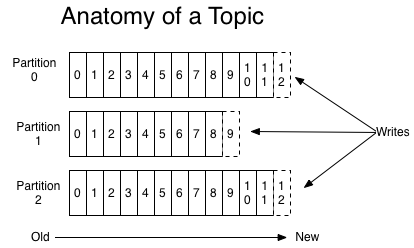
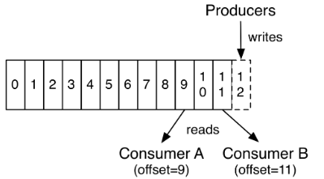

# Kafka:分布式流平台

[参考链接：Kafka官网](https://kafka.apache.org/intro)

Apache Kafka是一个分布式流平台，具有以下三个关键能力：

- 发布和订阅记录流（`streams of records`），类似于一个消息队列或者是企业消息系统；
- 以具有容错性和持久性的方式存储记录流；
- 即时处理记录流
<!-- more --> 
Kafka通常被用在两大类应用中：

- 构建可在系统或应用程序之间可靠获取数据的实时流数据管道
- 构建转换或响应数据流的实时流应用

一些概念：
- Kafka作为一个集群可以运行在一个或多个服务器上，这些服务器可跨多个数据中心；
- Kafka集群存储在类别中的记录流称为主题（topics）；
- 每个记录包含一个键（key）、一个值（value）以及一个时间戳（timestamp）；

Kafka有四个核心API：

- 生产者（Producer）API允许一个应用将记录流发布到一个或多个Kafka主题（topics）上；
- 消费者（Consumer）API允许一个应用去订阅一个或者多个主题（topics），并处理这些给它们生产的记录流；
- 流（Streams）API允许一个应用扮演流处理器的角色，从一个或多个主题消费一个输入流，然后向一个或多个主题输出流，高效地进行输入流到输出流的转换；
- 连接（Connector）API允许创建或者运行可重用的生产者或消费者，并与将Kafka主题与现有的应用或数据系统连接。例如关系数据库的连接器可以捕获对表的每个更改。

## 主题（Topics）和记录（Logs）

一个主题是发布记录的一个类别或订阅源名称。 Kafka中主题总是多订阅用户; 也就是说，一个主题可以有零个，一个或多个消费者订阅写入它的数据。  
对于每个主题，Kafka群集都维护一个如下所示的分区日志（partitioned log）：

  

每个分区（partition）都是有序的，不可变的记录序列，这些记录不断添加到结构化的提交日志中。分区中的每个记录都被分配一个称为偏移的序列id，这些id唯一标识了分区中的每个记录。  
Kafka集群使用可配置的保留期，持久保存所有已发布的记录，无论这些记录是否已被使用。 例如，如果保留策略被设置为两天，那么在发布记录后的两天内，记录都可以被消费，之后将被丢弃以释放空间。 Kafka的性能不受数据大小的影响，因此长时间存储数据不是问题。  
实际上，基于每个消费者保留的唯一元数据是该消费者在日志中的偏移或位置。 这种偏移由消费者控制：通常消费者会线性地提高其偏移量从而读取记录，但事实上，由于该位置由消费者控制，因此它可以按照自己喜欢的任何顺序去消费记录。 例如，消费者可以重置为较旧的偏移量去重新处理过去的数据，或者跳到最近的记录并从“现在”开始消费。

  

这些特性的组合意味着Kafka消费者非常方便，消费者的加入移除对集群或其他消费者没有太大影响。 例如，您可以使用我们的命令行工具“拖尾（tail，此处不太理解）”任何主题的内容，而无需更改任何现有使用者所消耗的内容。

日志中的分区有多种用途。 首先，它们允许日志扩展到超出适合单个服务器的规模。 每个独立分区必须适合托管它的服务器，但一个主题可能有多个分区，因此它可以处理任意数量的数据。 其次，分区充当了并行性的单元。

## 一些基本概念

1. Consumer Group：逻辑概念，对于同一个topic，会广播给不同的group。同一个group中只有一个consumer可以消费该topic。
2. Broker：物理概念，Kafka集群中的每个Kafka节点。
3. Partition：物理概念，Kafka下数据存储的基本单元。一个Topic数据，会被分散存储到多个Partition，每个Partition是有序的。
4. Replication：同一个Partition可能会有多个副本（replication），多个副本之间数据是一致的。
5. Replication Leader：一个Partition的多个副本需要选举一个leader负责partition上与Producer和Consumer消息传递。
6. ReplicaManager：负责管理当前Broker所有分区和副本的信息，处理KafkaController发起的请求，如副本状态的切换（重新选举Replication Leader）、添加消息、消费消息等。