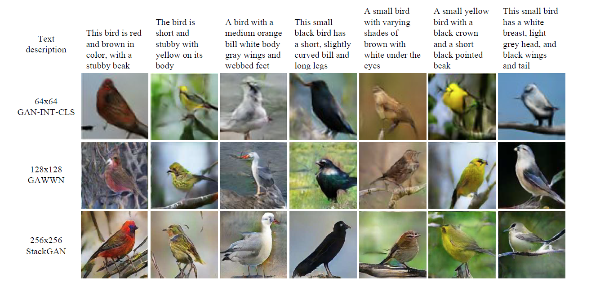
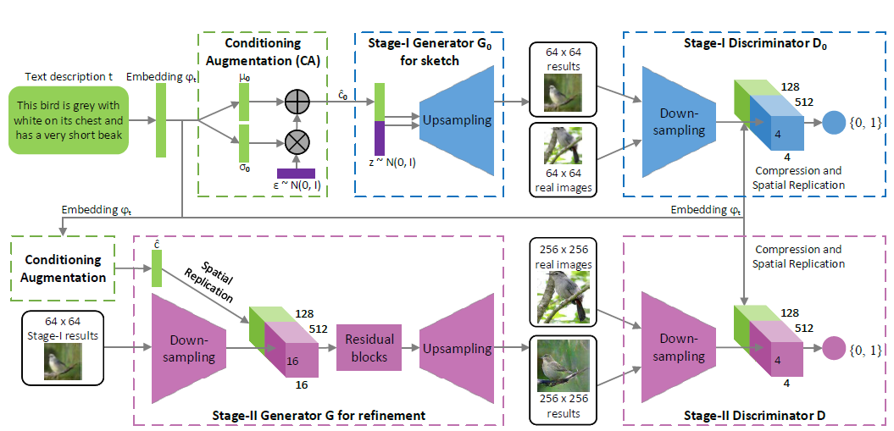

## Abstract

[源码地址：https://github.com/hanzhanggit/StackGAN](https://github.com/hanzhanggit/StackGAN)

这篇文章提出`Stacked Generative Adversarial Networks (StackGAN)`合成高分辨率（$256 \times 256$）的逼真图像。这个模型将困难的图像合成问题分成两个子问题：`Stage-I GAN`根据输入的文本描述合成对象的基本形状和颜色；`Stage-II GAN`根据`Stage-I GAN`以合成的图像结果和文本描述作为输入，丰富合成图像的细节，生成逼真的高分辨率图像。 

<!-- more --> 
我们都知道生成对抗网络的训练过程存在不稳定性，作者提出了一种新的条件增强技术促进潜在条件流形（`latent conditioning manifold`）的平滑性，从而改善了合成图像的多样性和训练生成对抗网络过程的稳定性。

## Stacked Generative Adversarial Networks

`Stacked Generative Adversarial Networks`的结构如下图所示分为`Stage-I GAN`和`Stage-II GAN`两个子网络：  

- `Stage-I GAN`：以文本描述和噪声向量为输入，文本描述控制对象的基本形状和颜色，噪声控制背景布局，从而生成一张低分辨率图像；
- `Stage-II GAN`：纠正`Stage-I`生成的低分辨率图像的缺陷，再次通过读取文本描述来补全图像的细节，从而生成高分辨率的逼真图像。

### Stage-I GAN

#### KL散度（`Kullback–Leibler divergence,KL divergence`）
本文章中的条件增强技术中计算标准高斯分布和条件高斯分布之间的KL散度，所以先简单介绍KL散度。  
KL散度又被称为相对熵（`relative entropy`）或者信息散度，是连个概率分布间差异的非对称性度量。  

$$
KL(p(x)||q(x))=\sum_x{p(x)\log{\frac{p(x)}{q(x)}}}\\\\
=\sum_x{p(x)\log{p(x)}-p(x)\log{q(x)}}
$$

KL散度是衡量两个分布之间的差异大小的，KL散度大于等于0，并且越接近0说明p与q这两个分布越像，当且仅当p与q相等时KL散度取0。

#### 模型框架
对于生成器$G_0$，为了获得文本条件变量$\hat{c}_0$，文本嵌入$\varphi_t$首先通过全连接层生成$\mu_0$和$\delta_0$（$\delta_0$是$\sum_0$的对角线元素值）。$\hat{c}_0$由高斯分布$N(\mu(\varphi(t)),\sum_0(\varphi(t)))$抽样得到。$N_g$维的条件向量$\hat{c}_0$由公式$\hat{c}_0=\mu_0+\delta_0 \bigodot\epsilon$计算得到，其中$\bigodot$表示元素乘积（`element-wise multiplication`），$\epsilon\sim\N(0,I)$。之后，$\hat{c}_0$与$N_z$维的噪声向量拼接并通过一系列的上采样块生成尺寸为$W_0\times H_0$的图像。  
对于判别器$D_0$,文本嵌入$\varphi(t)$通过全连接压缩为$N_d$维然后通过复制将其转换成$M_d \times M_d \times N_d$大小的张量。同时图像经过一系列下采样块，输出$M_d \times M_d$大小的张量。最后把图像和文本得到的张量拼接在一起，经过$1\times 1$的卷积层以及一个只有一个节点的全连接层，从而得到决策值。  
Stage-I训练过程损失函数如下，目的在于最大化$L_{D_0}$以训练判别器，最小化$L_{G_0}$以训练生成器。

$$
L_{D_0}=E_{(I_0,t)\sim{p_{data}}}[\log D_0(I_0,\varphi_t)]
+E_{z\sim{p_z},t\sim p_{data}}[\log {(1-D_0(G_0(z,\hat{c}_0),\varphi_t)}]\\\\
L_{G_0}=E_{z\sim{p_z},t\sim p_{data}}[\log {(1-D_0(G_0(z,\hat{c}_0),\varphi_t)}]+\lambda{D_{KL}}(N(\mu_0(\varphi_t),\sum_0(\varphi_t)||N(0,I)),
$$

### Stage-II GAN
`Stage-II GAN`的模型框架和`Stage-I GAN`相似，只不过没有了噪声输入，换成了`Stage-I`合成的低分率图像。
Stage-II其损失函数如下，目的在于最大化$L_D$以训练判别器，最小化$L_G$以训练生成器。  

$$
L_D=E_{(I,t)\sim{p_{data}}}[\log D(I,\varphi_t)]
+E_{s_0\sim{p_{G_0}},t\sim p_{data}}[\log {(1-D(G(s_0,\hat{c}),\varphi_t)}]\\\\
L_G=E_{s_0\sim{p_{G_0}},t\sim p_{data}}[\log {(1-D(G(s_0,\hat{c}),\varphi_t)}]+\lambda{D_{KL}}(N(\mu(\varphi_t),\sum(\varphi_t)||N(0,I)),
$$
