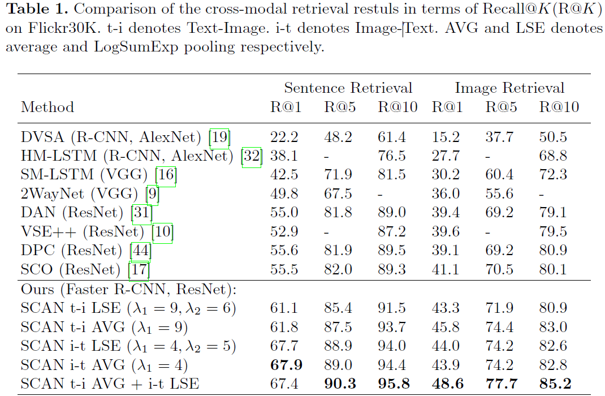
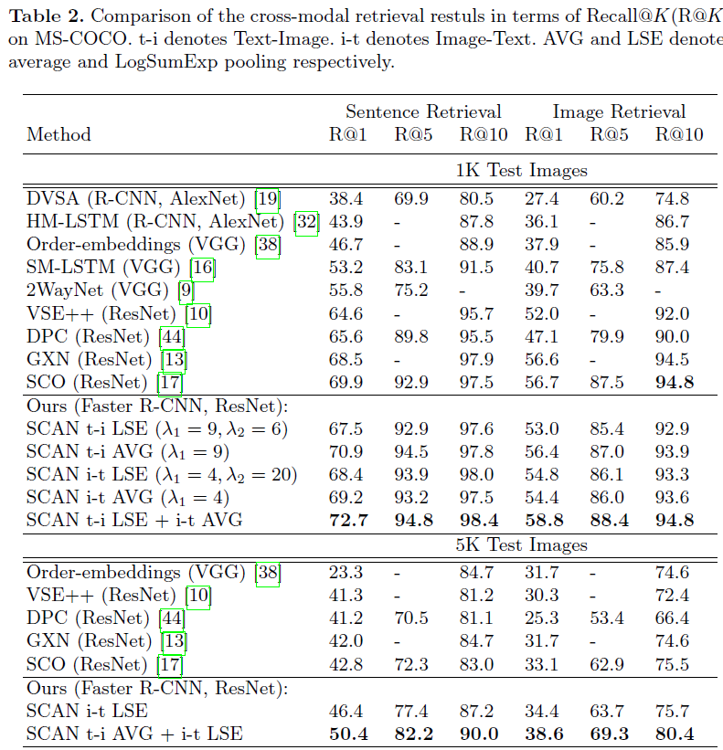

## 这篇文章做了什么？
通过对图像中的对象或者突出内容与句子中的单词进行潜在语义对齐，使得图文匹配过程能够捕获到视觉与语言之间细粒度的相互关系，使得图文匹配更具有可解释性。目的是将单词和图像区域映射到同一嵌入空间（`common embedding space`）从而推断整个图像与句子之间的相似度。
<!-- more --> 
## 相比于已有的方法有什么优点？
已有方法：
1. 简单聚合所有可能的区域以及单词对之间的相似度，却没有关注区分单词和区域之间的重要性；
2. 使用多步骤的注意力过程来捕获数量有限且缺乏一定解释性的语义对齐。

这篇文章使用提出的`Stacked Cross Attention`去发现在图像区域和单词之间的所有潜在对齐，从而计算图文相似度。已有方法通过执行固定步骤的注意力推理，从而在一个时刻只能发现有限的语义对齐，而`Stacked Cross Attention`可以同时发现所有可能的语义对齐。由于语义对齐的数量随着不同的图像和句子而变化，因此`Stacked Cross Attention`方法推断出的对应关系更加全面，从而使图像文本匹配更具可解释性。
## 这篇文章是怎么做的？

1. 利用自底向上的注意力机制检测图像区域，并提取图像区域的特征；
2. 将句子中的单词及其句子上下文映射为特征向量；
3. 应用`Stacked Cross Attention`通过对齐图像区域和单词特征来推断图文相似度。
4. 这篇文章的损失函数关注每一个`Batch`中最负面的图文对（也就是最不匹配的图文对）。所以对于给定的正样例对$(I,T)$，那么最负样例对定义为$\hat{I}_h=argmax_{m\neq{I}}S(m,T)$以及$\hat{T}_h=argmax_{d\neq{T}}S(I,d)$。所以这篇文章定义损失函数如下：  

$$
l_{hard}(I,T)=[\alpha-S(I,T)+S(I,\hat{T}_h)]_++[\alpha-S(I,T)+S(\hat{I}_h,T)]_+
$$

## 怎么文章题目中的`Stacked Cross Attention`？
`Stacked Cross Attention`通过两个阶段来关注图像和文本的上下文信息。第一个阶段，给定一个图像和一个句子，关注每个图像区域对应的句子中的单词，并将每个图像区域与来自句子的受关注信息进行比较，以确定图像区域的重要性（比如图像区域在句子中是否被提到）。第二阶段，与第一阶段相似的，根据每个单词对应的图像区域来决定每个单词的重要性（也就是对每个单词的关注度）。

## 文章的实验结果展示

这篇文章在Flickr30K以及MS-COCO数据集上进行实验，结果如下：

