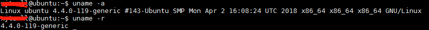
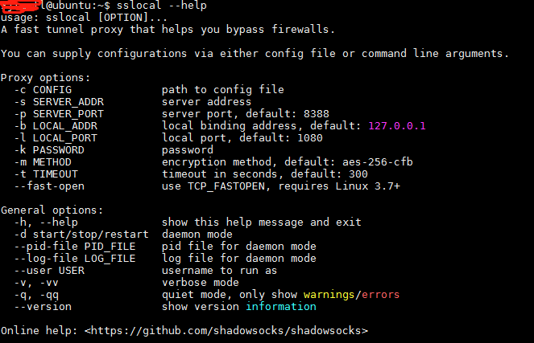
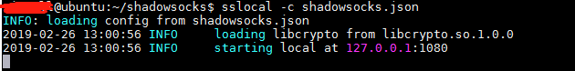
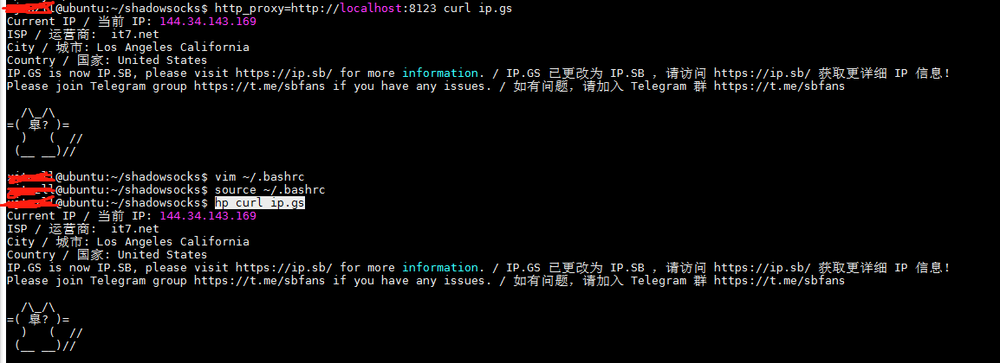
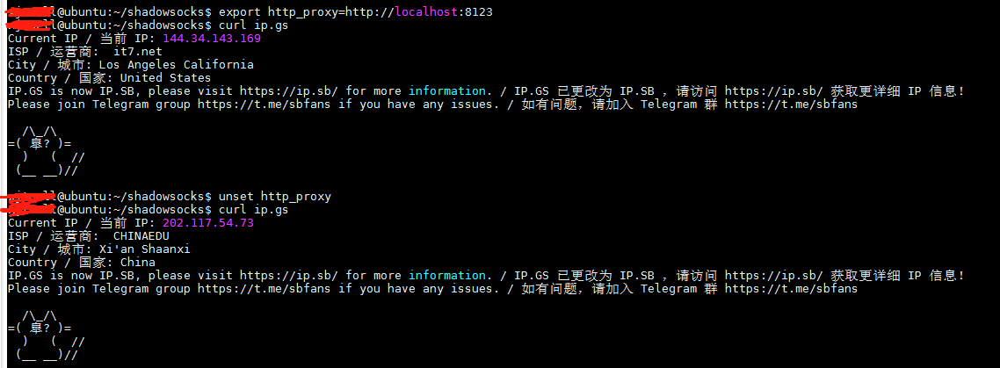
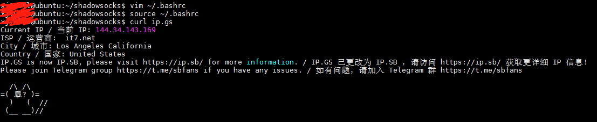
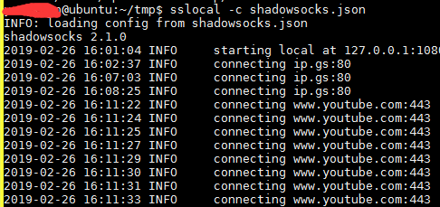

## 系统环境



## showsocks配置

1. 安装shadowsocks客户端,命令如下

```
sudo apt install shadowsocks
```
<!-- more --> 
2. 查看shadowsocks命令：

```
sslocal --help
```



3. 启动shadowsocks两种方式：

- 通过设置各个参数，如下

```
sslocal -s 11.22.33.44 -p 50003 -k "123456" -l 1080 -t 600 -m aes-256-cfb
```

- 或者，直接加载json配置文件

```
sslocal -c file_path/shadowsocks.json
```

启动shadowsocks如下所示：



配置好shadowsocks客户端后，我们介绍一下三种方式设置代理模式。

## 方式一：不要关闭上面的终端，重新打开一个终端，配置全局变量：

使用`vim ~/.bashrc`添加语句
```
alias hp="http_proxy=http://localhost:8123" 
```
使用`source ~/.bashrc`使更改生效。

5. 测试效果

- 使用命令`hp curl ip.gs`查看代理服务器网址，结果如下所示：



可以看出，`alias hp="http_proxy=http://localhost:8123" `这句语句的作用就是用命令`hp`替换`http_proxy=http://localhost:8123`这一串长命令。

## 那我们不想每条指令前面都加上命令`hp`怎么办，这就需要设置全局代理：

### 方式二：为当前窗口设置全局代理

命令如下：
```
export http_proxy=http://localhost:8123 # 当前终端使用代理
unset http_proxy # 当前终端取消代理
```

测试如下所示，可以看出上设置全局代理后，就不需要`hp`命令了，取消代理（`unset`）后可以看到`ip`变成了陕西西安。


### 方式三：设置当前用户的全局代理

在`~/.bashrc`中添加`export http_proxy=http://localhost:8123`命令设置当前用户的全局代理。别忘了使用`source ~/.bashrc`使更改生效。

如下所示，



## 经过测试，推荐方式二为当前窗口设置全局代理，命令如下：

```
export http_proxy=http://localhost:8123 # 当前终端使用代理
unset http_proxy # 当前终端取消代理
```

这种方式可以开启一个窗口运行export作为科学上网窗口，而其他窗口依旧正常上网，这样可以**节约流量**。  
除此之外，这是我测试的上述三种上网方式中最稳定的一种，建议使用。

## 总结

配置好之后，科学上网的过程，先打开一个终端窗口，运行：

```
sslocal -c file_path/shadowsocks.json
```
再打开新窗口，运行
```
export http_proxy=http://localhost:8123 
```

我使用R-3D中下载YouTube视频的代码作为测试，运行`python download_video.py`就可以看到下载视频并保存在当前目录的videos目录下。

示意结果如下，`sslocal -c shadowsocks.json`启动窗口下方会出现与`www.youtube.com`连接的日志信息：




