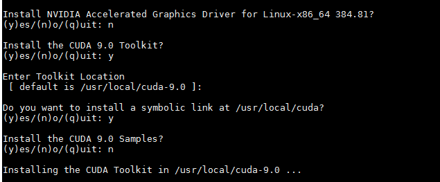
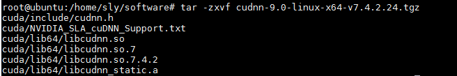
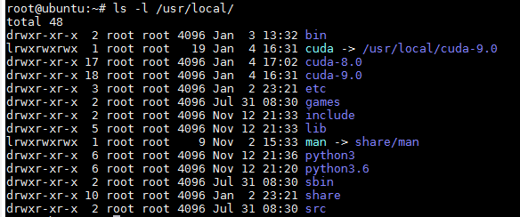

# cuda安装
## cuda和cudnn版本查看
1. cuda版本

```
cat /usr/local/cuda/version.txt
```

2. cudnn版本

```
cat /usr/local/cuda/include/cudnn.h | grep CUDNN_MAJOR -A 2
```

## cuda8.0卸载
1. 卸载

```
apt autoremove cuda
```

2. 清除残留文件

```
cd /usr/local/
rm -rf cuda-8.0/
```

## cuda9.0及对应cudnn安装
### cuda9.0安装
[cuda9.0官方网站](https://developer.nvidia.com/cuda-90-download-archive)

1. 运行压缩.run

```
sudo sh cuda_9.0.176_384.81_linux.run
```
- 一般在不需要图形驱动（Grphics Driver）和 样例（cuda samples）



[cudnn官方网站](https://developer.nvidia.com/cudnn)

2.~/.bashrc配置

```
export CUDA_HOME=/usr/local/cuda
export LD_LIBRARY_PATH=${CUDA_HOME}/lib64
export PATH=${CUDA_HOME}/bin:${PATH}
```
3. 刷新使得配置生效

```
source ~/.bashrc
```


### cudnn安装

本次版本是**cuDNN v7.4.2 (Dec 14, 2018), for CUDA 9.0**，选择**cuDNN Library for Linux**。
1. 解压cudnn-9.0-linux-x64-v7.4.2.24.tgz压缩包

```
tar -zxvf cudnn-9.0-linux-x64-v7.4.2.24.tgz
```


2. 复制文件到cuda库下

```
cp cuda/lib64/* /usr/local/cuda-9.0/lib64/
cp cuda/include/* /usr/local/cuda-9.0/include/
```

3. 查看cudnn版本信息

```
cat /usr/local/cuda/include/cudnn.h | grep CUDNN_MAJOR -A 2
```

### cuda切换
当一台服务器上既安装了cuda8.0和cuda9.0，使用ls命令查看/usr/local下的文件包含三个文件夹cuda、cuda8.0和cuda9.0。

```
ls -l /usr/local/
```


1. 可以看到，当前cuda文件夹链接到cuda-9.0,当需要切换到cuda8.0时，使用以下命令：

```
rm -rf /usr/local/cuda #删除之前创建的软链接
sudo ln -s /usr/local/cuda-8.0/ /usr/local/cuda
nvcc --version #查看当前 cuda 版本
```


[参考博客：http://geyao1995.com/CUDA8_CUDA9/](http://geyao1995.com/CUDA8_CUDA9/)