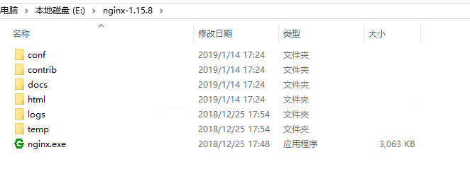
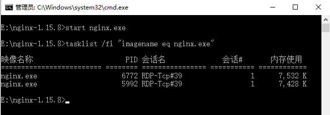
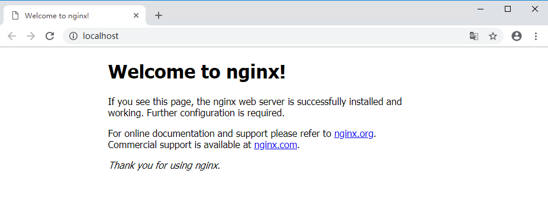
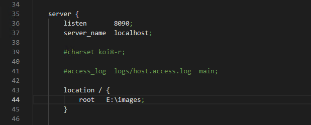
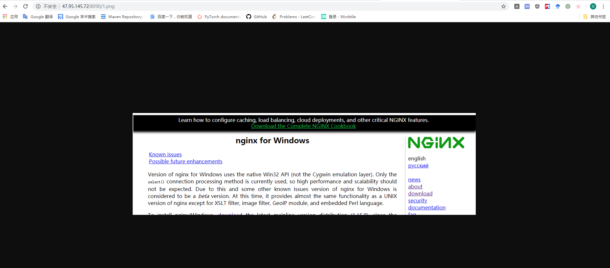

# 图片服务器搭建

**环境**：window server 2016 Datacenter

1. 首先下载`nginx`软件包，我下在的版本是`nginx-1.15.8`，下载链接和英文安装教程如下:

- [nginx下载地址](http://nginx.org/en/download.html) 
- [nginx英文安装教程](http://nginx.org/en/docs/windows.html) 
<!-- more --> 
2. 解压`nginx-1.15.8.zip`，目录结构如下图所示：  



3. 运行`nginx.exe`,并查看通过命令查看运行状态，如下所示：  



如果没有运行成功，可以通过打开`logs\error.log`查看错误记录。

4. 打开浏览器，输入`localhost`测试是否成功，如下图所示：



5. 搭建图片服务器

首先打开`conf`目录下的`nginx.conf`配置文件，修改如下：



6. 重新启动`nginx`，一些命令如下：


```
nginx -s stop	   fast shutdown
nginx -s quit	   graceful shutdown
nginx -s reload	   changing configuration, starting new worker processes with a new configuration, graceful shutdown of old worker processes
nginx -s reopen	   re-opening log files
```

7. 此时在`images`文件夹下放一张随意图片（我放了一张`nginx`网站的截图），打开浏览器，输入链接`http://47.95.145.72:8090/1.png`，就可以看到我们的图片，如下所示：



**到这里，图片服务器就搭建完成了！**