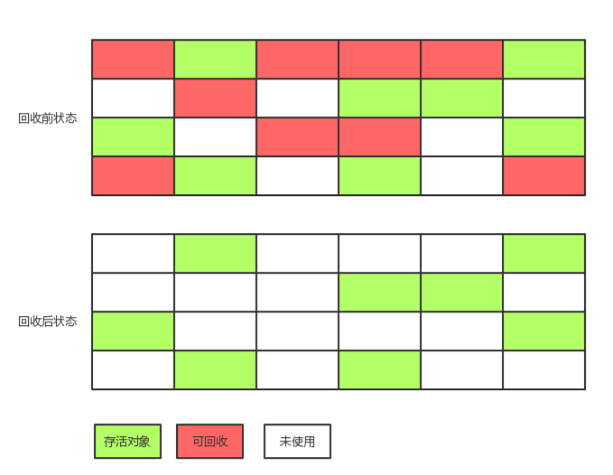
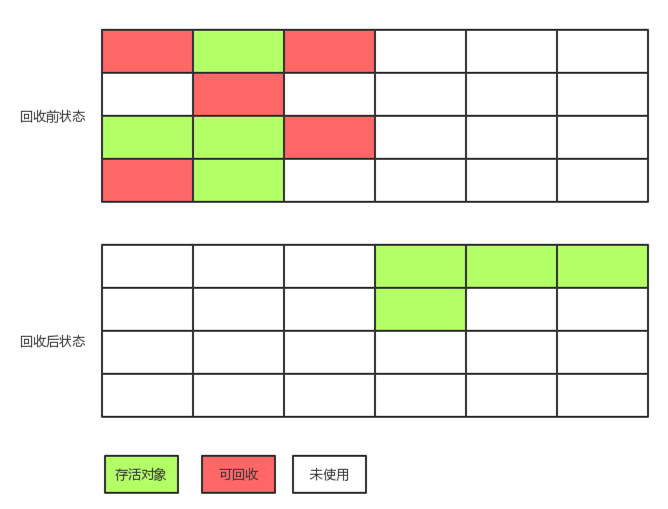
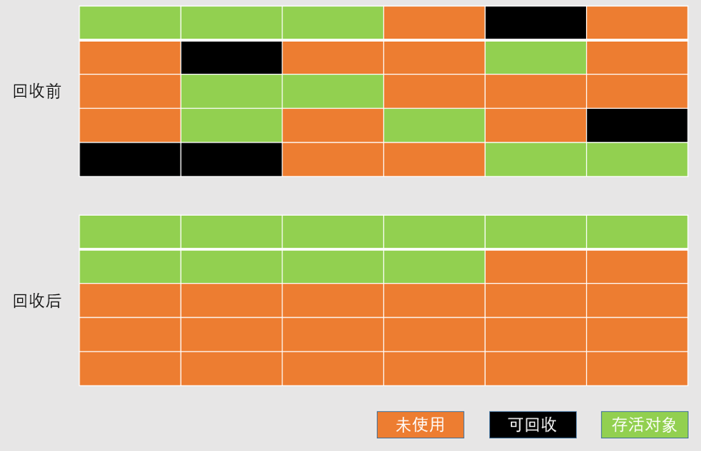

# 垃圾收集

## 垃圾收集算法
### 标记-清除算法
算法分为标记阶段和清除阶段 ，首先标记出所有需要回收的对象，在标记完成后统一回收所有被标记的对象，它的标记过程就是引用计数法或者可达性算法判断对象是否存活的过程。  
不足：  
1. 效率问题，标记和清除两个阶段的效率都不高；
2. 空间问题，标记清除之后会产生大量不连续的内存碎片，空间碎片太多可能会导致以后程序运行过程中需要分配较大对象时，无法找到足够的内存碎片而不得不提前出发一次垃圾收集动作。  
标记清除算法的执行过程如下图所示：  


<!-- more --> 
### 复制算法
为了解决效率问题，一种“复制”的垃圾收集算法出现了，它将可用的内存分成大小相等的两个区域，每次只使用其中的一块区域。当这块区域用完之后，就将还存活着的对象复制到另一块内存区域上，然后再把已使用过的内存空间一次清理掉。这样使得每次都是对整个半区进行垃圾回收，内存分配时也就不用再考虑内存碎片等复杂情况，只要移动堆顶指针，按顺序分配内存即可，实现简单，运行高效。只是这种算法每次只能使用一半的内存，相当于将内存缩小为原来的一半，代价太高。复制算法的执行过程如下图所示：



目前的商业虚拟机都是采用复制算法回收新生代，但是并不按照```1:1```划分内存空间，而是将内存分为一块较大的Eden空间和两块较小的```Survivor```空间，每次使用```Eden```和其中一块```Survivor```。当回收时，将Eden和Survivor中还存活的对象一次性复制到另一块```Survivor```空间上，最后清理掉Eden和刚才用过的Survivor空间。```HotSpot```虚拟机默认```Eden：Survivor=8:1```，也就是每次新生代中可用内存空间为整个新生代容量的```90%```，只有```10%```的内存被“浪费”。当然在大多数（```98%```）情况下，只有不超过```10%```的对象存活，而当超过```10%```时，也就意味着```Survivor```空间不够用，这个时候就需要依赖老年代进行分配担保（无法再```Survivor```区存放的对象直接进入老年代）。

### 标记-整理算法
复制算法在对象存活率较高的情况下就会进行较多的复制操作，效率将会变低，而且还需要额外的内存空间进行分配担保，以应对内存（```Survivor```空间）不够容纳存活对象的极端情况。  
因此，老年代一般不采用复制算法，而采用“标记-整理”（```Mark-Compact```）算法，标记过程仍然与“标记-清除”算法一样，但后续步骤不是直接对可回收对象进行清理，而是让存活对象都向一端移动，然后直接清理掉端边界以外的内存，标记-整理算法的示意图如下：



### 分代收集算法

当前商业虚拟机的垃圾收集都采用“分代收集”（```Generational Collection```）算法，这种算法根据对象存活周期的不同将内存划分为几块。一般是把Java堆划分成新生代和老生代，从而根据各个年代的特点采用最适当的收集算法。在新生代中，每次垃圾收集都会发现大量的对象死去，只有少量对象存活，因此采用复制算法，只需要付出少量存活对象的复制成本就可以完成收集；在老年代中因为对象存活率高、没有额外的空间对它进行分配担保，就必须采用“标记-清理”或者“标记-整理”算法进行回收。

## HotSpot的算法实现
### 枚举根节点
从可达性分析中从```GC Roots```节点找到引用链这个操作为例，可作为```GC Roots```的加点主要在全局性的引用（例如常量或类静态变量）与执行上下文（例如栈帧中的本地变量表）中，现在的很多应用仅仅方法区就有数百兆，如果要逐个检查这里面的引用，那么必然会消耗很多时间。  
另外，可达性分析对执行时间的敏感还体现在```GC```停顿上，因为这项分析工作必须在一个能确保一致性的快照中进行——这里的“一致性”的意思是在真个分析过程中整个执行系统看起来就像被冻结在某个时间点上，不可以出现分析过程中对象引用关系还在不断变化的情况，该点不满足的话分析结果准确性就无法得到保证。这点是导致在```GC```进行时必须停止多有```Java```执行线程的其中一个重要原因。即时在号称（几乎）不会发生停顿的```CMS```收集器中，枚举根节点时也是必须要停顿的。  
由于目前主流的```Java```虚拟机使用的都是准确式```GC```，所以当执行系统停顿下来后，并不需要一个不漏地检查完所有执行上下文和全局的引用位置，虚拟机应当是有办法直接得知哪些地方存放着对象引用。在```HotSpot```的实现中，是使用一组称为```OopMap```的数据结构来达到这个目的，在类加载完成时，```HotSpot```就把对象内什么偏移量上是什么类型的数据计算出来，在```JIT```编译过程中，也会在特定位置记录下栈和寄存器哪些位置是引用。
### 安全点
在```OopMap```的协助下，```HotSpot```可以快速且准确地完成```GC Roots```枚举，但一个很现实的问题随之而来：可能导致引用关系发生变化，或者说```OopMap```内容变化的指令非常多，如果每一条指令都生成对应的```OopMap```，那将会需要大量的额外空间，这样```GC```的空间成本就会变得很高。  
实际上，```HotSpot```也的确没有为每条指令都生成```OopMap```，前面已经提到只是在“特定的位置”记录这些信息，这些位置称为安全点（```Safepoint```），即程序执行时并非在所有的地方都能停顿下来开始GC，只有到达安全点时才能暂停。```Safepoint```的选定既不能太少以致于GC等待时间过长，也不能过于频繁以致于过分增大运行时的负荷。所以，安全点的选定基本上是以程序“是否具有让程序长时间执行的特征”为标准进行选定的————因为每一条指令执行的时间都非常短暂，程序不太可能因为指令流长度太长这个原因而过长时间运行，“长时间执行”最明显的特征就是指令序列复用，例如方法调用、循环跳转、异常跳转等，所以具有这些功能的指令才回产生```Safepoint```。  
对于```Safepoint```，另一个需要考虑的问题就是如何在GC发生时让所有的线程都“跑”到最近的安全点上停顿下来。这里有两种方案可以选择:抢先式中断（```Preemptive Suspension```）和主动式中断（```Voluntary Suspension```），其中抢先式中断不需要线程的执行代码主动去配合，在GC发生时，首先把所有的线程全部中断，如果发现线程中断的地方不在安全点上，就恢复线程，让它“跑”到安全点上。现在几乎没有虚拟机实现采用抢先式中断来暂停线程从而相应GC时间。
而主动式中断的思想是当GC需要中断线程的时候，不直接对线程操作，仅仅简单地设一个标志，各个线程执行时主动去轮询这个标志，发现中断标志为真时就自己中断挂起。
### 安全区域
使用```Safepoint```似乎已经完美解决了如何进入```GC```的问题，但实际情况却并不一定。```Safepoint```机制保证了程序执行时，在不太长的时间内就会遇到可进入```GC```的```Safepoint```。但是程序不执行的时候，```CPU```没有分配时间给程序，典型例子就是线程处于```Sleep```或者```Blocked```状态，这时线程无法响应```JVM```的中断请求，“走”到安全的地方去挂起中断，```JVM```也不太可能等待这些线程重新分配```CPU```时间。  
对于这种情况就需要安全区域（```Safe Region```）来解决。安全区域是指在一段代码片段中，引用关系不会发生变化。在这个区域中的任何地方开始GC都是安全的。  
在线程执行到```Saferegion```中的代码时，首先标志自己进入了```Saferegion```，那样当在这段时间里```JVM```要发起```GC```时，就不用管标志自己为```Saferegion```状态的线程了。在线程要离开```Saferegion```时，它要检查系统是否已经完成了根节点枚举（或者整个```GC```过程），如果完成了那么线程继续执行，否则它就要等待直到收到可以安全离开```Saferegion```的信号为止。